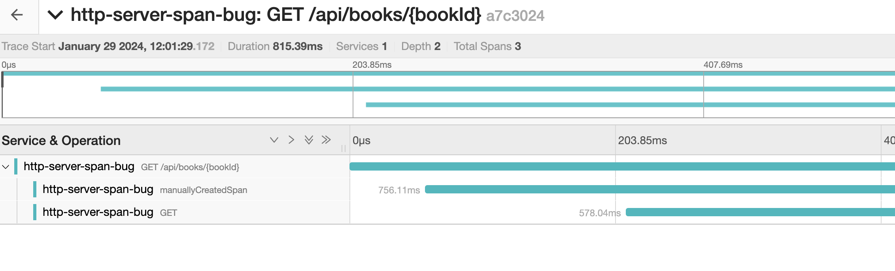

## @NewSpan annotation isn't set as parent for new spans

This project demos how with the latest version of micronaut and OTEL the @NewSpan annotation doesn't seem to work as expected. 

## To Run the test

To see the issue please run

```bash
./gradlew test --info
```

## To Run the app

In the app you'll make a request and see the trace gets split into 2 parts and also that parents aren't always set correctly.

### Dependencies

You'll also need to start something like jaeger using

```bash
docker run --name jaeger3 -e COLLECTOR_OTLP_ENABLED=true -p 16686:16686 -p 4317:4317 -p 4318:4318 jaegertracing/all-in-one:1.35
```
Now start the app
```bash
./gradlew run
```

Make a request to see books by id

```bash
curl --location 'http://localhost:8085/api/books/book-1'
```

then browse to [http://localhost:16686/](http://localhost:16686/) find the app in the drop down and click Find Traces button. You'll then see that instead of single trace you have 2


ALso when you drill into those traces the parent/child relationships aren't always set correctly. E.g. here you see the the `GET` span is a sibling of the `manuallyCreatedSpan`. HOWEVER it SHOULD be a child.

