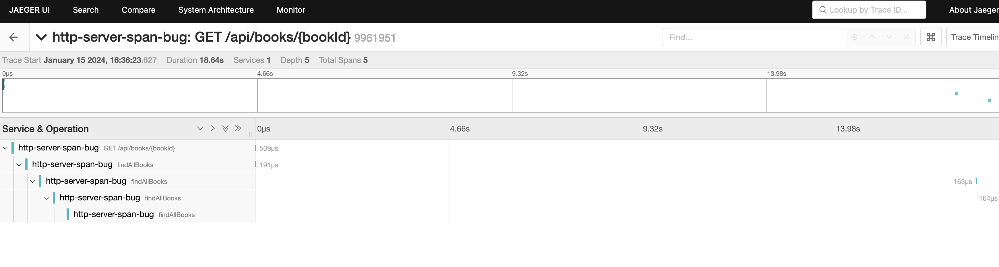
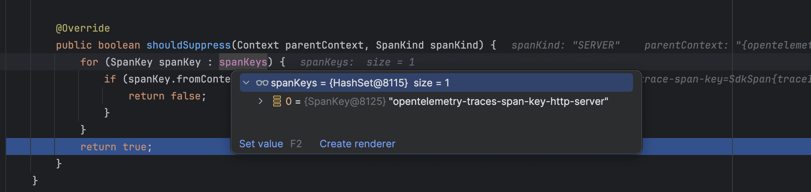

## Span.makeCurrent() causes http server spans to not be created.

This project demos how with the latest version of micronaut and OTEL the http server spans are NOT created when a child span is set as the current span inside a mono.

Linked to this issue https://github.com/micronaut-projects/micronaut-tracing/issues/475

## To Run the test

To see the issue please run

```bash
./gradlew test --info
```

## To Run the app

In the app this causes a span to get bigger and bigger.

### Dependencies

You'll also need to start something like jaeger using

```bash
docker run --name jaeger3 -e COLLECTOR_OTLP_ENABLED=true -p 16686:16686 -p 4317:4317 -p 4318:4318 jaegertracing/all-in-one:1.35
```
Now start the app
```bash
./gradlew run
```

Make a request to see books by id

```bash
curl --location 'http://localhost:8082/api/books/book-1'
```

then browse to [http://localhost:16686/](http://localhost:16686/) find the app in the drop down and click Find Traces button.

If you use postman and ensure you select keep alive for the connection the spans get bigger and bigger.


## Initial investigation

We've tracked the problem down to this [line](https://github.com/micronaut-projects/micronaut-tracing/blob/master/tracing-opentelemetry-http/src/main/java/io/micronaut/tracing/opentelemetry/instrument/http/server/OpenTelemetryServerFilter.java#L82). Where this returns false for the 2nd http request. This uses the

SpanSuppressors.java in OTEL which supresses the 2nd http request as the context seems to have an existing http server key on there.

At this points i'm not sure what the issue is or how moving from micronaut 3 to 4 has caused this issue.. Would love some help on it.
